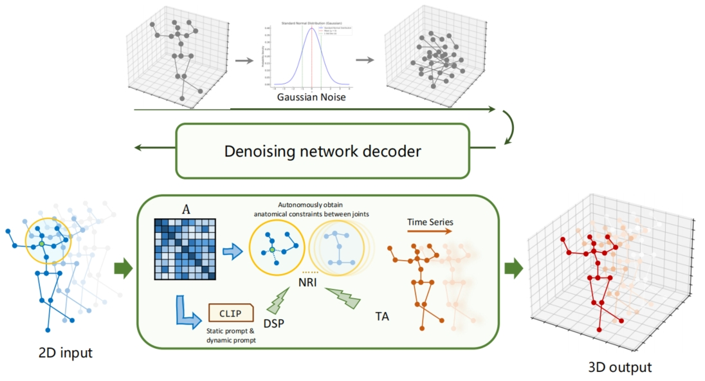
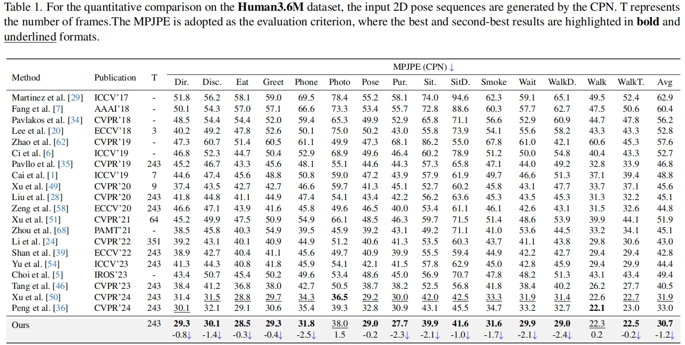
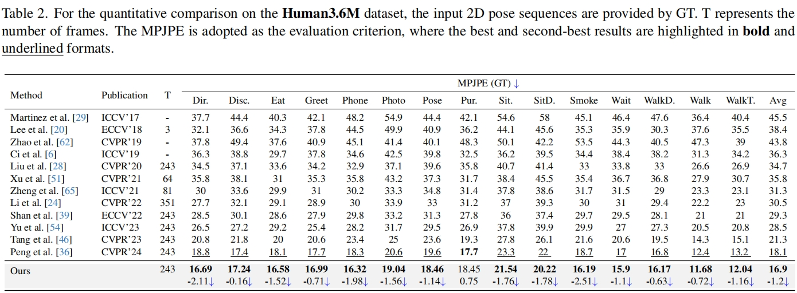
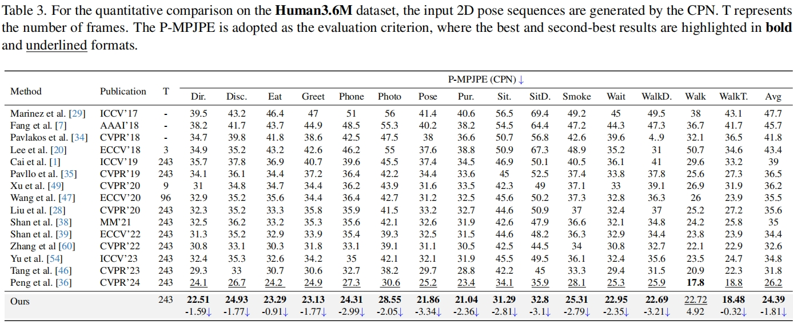
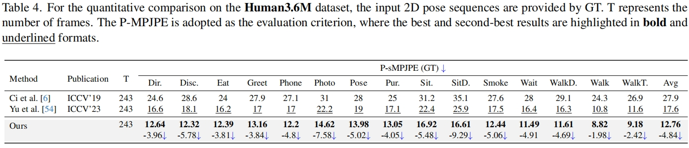
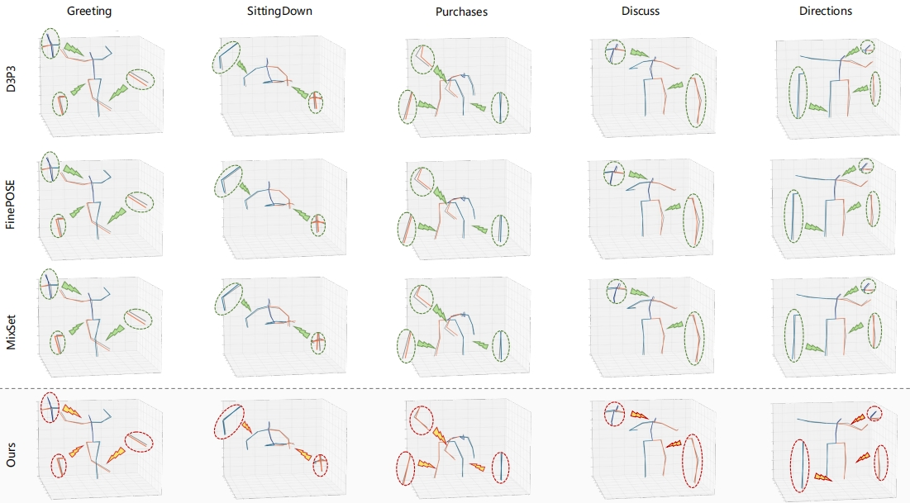

# 
GraphDiffu: A Graph-Driven Diffusion Model for 3D Human Pose Estimation with Autonomous Motion Pattern Learning。

<strong>Fangjing Li1, Xinxin Ding1, yileiguo1,Haiyang Liu1Jidong Yuan1,Diping Wang1,Zhihai Wang1 </strong>

 

1School of Computer Science & Technology, Beijing Jiaotong University 

 

  <a href="https://www.bilibili.com/" target="_blank">
    

      &#128293;
      Demo
    

  </a>
  <a href="https://openreview.net/attachment?id=LNKOQNiN1w&name=pdf" target="_blank">
    

      &#9781; 
      paper
    

  </a>
  <a href="https://anonymous.4open.science/r/GraphDiffu-320B/README.md" target="_blank">
    

      &#9998; 
      code
    

  </a>

## Introduction

Accurate 3D human pose estimation requires an in-depth understanding of anatomical constraints and the dynamic 
interactions between joints, as even minor estimation errors 
in joint coupling can lead to significant mistakes in motion 
analysis. For instance, the coordinated movement between 
the knee and ankle during sprinting or the complex cou- 
pling between the shoulder and elbow during a throwing 
motion is crucial for realistic reconstruction. In this work, 
we propose GraphDiffu, a novel diffusion-based framework 
designed to automatically learn natural human motion pat
terns that enforce anatomical constraints and capture com
plex inter-joint interactions to enhance 3D human pose es
timation. The core of GraphDiffu is the Neighborhood Re
lationship Interactor (NRI), which models the interactions 
between anatomically connected joints to simulate the co
ordinated activation of human joints, thereby avoiding erro
neous motion estimations and reducing minor errors in joint 
coupling. To assist NRI, our framework employs Dual Se
mantic Prompts (DSP) that utilize dynamic prompts to cap
ture the temporal sequence dependencies in motion through 
their memorability and static prompts to encode the spatial 
sequence dependencies of different body parts for stability. 
In addition, during the reverse denoising process we inte
grate a Time-Aware Modulator (TA) that adaptively adjusts 
the denoising intensity at each step to accommodate vary
ing motion rhythms. Extensive experimental results in the 
wild show that our model outperforms the state of the art.

## Overview

    

The GraphDiffu framework integrates a graph-driven diffusion process, where the NRI serves as the core of the denoising
network, dynamically modeling inter-joint dependencies based on anatomical adjacency relationships. Additionally, DSP and the TA refine
the denoising process by enhancing motion consistency and adaptively adjusting noise removal intensity based on temporal variations.

## Results

Our model achieves state-of-the-art results on Human3.6M and MPI-INF-3DHP. We provide below an overview of the main Human3.6M results with various keypoint detectors and evaluation criterion.

## Visualization

Visualize the test results of our model and compare them with those of other models. Our model demonstrated better performance. The comparison results are shown in the figure.

## Demo
### Demos in the wilds
Our model generates a smooth reconstruction even on YouTube videos, which demonstrates the powerful generalization ability of our model.

 
<video width="640" height="240" controls>
  <source src="./videos/video1.mp4" type="video/mp4">

</video>
<video width="640" height="240" controls>
  <source src="./videos/video1.mp4" type="video/mp4">

</video>

### Demos in Human3.6M
The comparison between our model and other models on H36M demonstrates the superiority of our model over others.

<video width="640" height="240" controls>
  <source src="./videos/video1.mp4" type="video/mp4">

</video>

 

<video width="640" height="240" controls>
  <source src="./videos/video1.mp4" type="video/mp4">
</video>

## Reference

> An awesome project.
